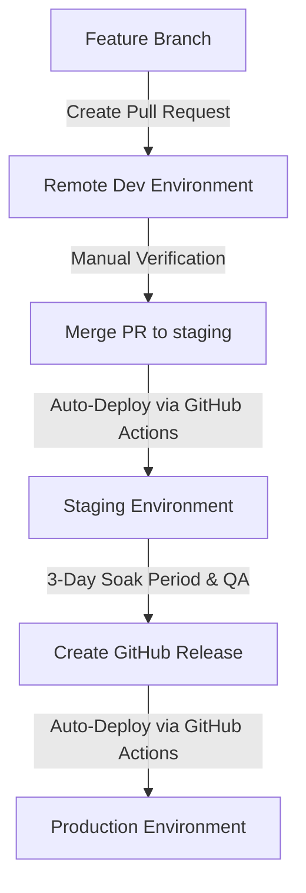

# Git-Driven Development & Deployment

Historically, changes were made directly on production or test servers via FTP, WP Admin, or SSH, leading to overwritten modifications and unstable code. We enforce a strict **Git-Driven Lifecycle** where no code is edited directly on any server.

## Repository Structure

We maintain a single private GitHub repository named `myrehat-custom-code` that tracks only our custom themes, child themes, and custom plugins:

```text
myrehat-custom-code/
├── wp-content/
│   ├── themes/
│   │   └── homey-myrehat/       # Our custom child theme
│   └── mu-plugins/
│       └── myrehat-redirects.php # Redirects & custom business logic
└── .github/
    └── workflows/
        ├── deploy-staging.yml    # CI/CD to Staging
        ├── deploy-production.yml # CI/CD to Production
        └── preview-env.yml       # Ephemeral PR Environments
```

## Branching Strategy & Release Lifecycle

Our development lifecycle is designed for safety, speed, and isolated testing:



### 1. Remote Dev (Ephemeral PR Environments)
* **Trigger:** Creating or updating a Pull Request (PR) targeting the `staging` branch.
* **How it works:** 
  1. GitHub Actions spins up an ephemeral directory on our VM: `/var/www/myrehat-pr-X/`.
  2. A dedicated MySQL database `myrehat_pr_X` is created and seeded with a sanitized, scrambled copy of the production database (`/home/ubuntu/db_templates/seeded_template.sql`). This protects customer privacy while providing realistic test data.
  3. OpenLiteSpeed enlists a virtual host for `pr-X.dev.myrehat.com`.
  4. The Cloudflare CLI (`cf`) dynamically registers the subdomain pointing to our VM.
* **Cleanup:** When the PR is merged or closed, GitHub Actions automatically drops the database, deletes the directory, removes the virtual host, and tears down the Cloudflare DNS record.

### 2. Staging (The Default Branch)
* **Branch:** `staging`
* **Trigger:** Merging a Pull Request into `staging`.
* **Deployment:** GitHub Actions automatically builds, tests, and deploys the code to `staging.myrehat.com`.
* **Soak Period:** All changes must spend a minimum of **3 days** on Staging for verification and QA testing before they can be promoted to Production.

### 3. Production (Manual Releases)
* **Branch:** `main`
* **Trigger:** Creating a GitHub Release (e.g., tagging `v1.2.0`).
* **Deployment:** Merging `staging` into `main` and publishing a release triggers GitHub Actions to deploy the code to `myrehat.com`.
* **Gatekeeping:** Direct pushes to `main` are disabled. All production deployments require approval from the CTO.

---

Next Chapter: [Database & Codebase Maintenance Guidelines](/docs/database-maintenance)
